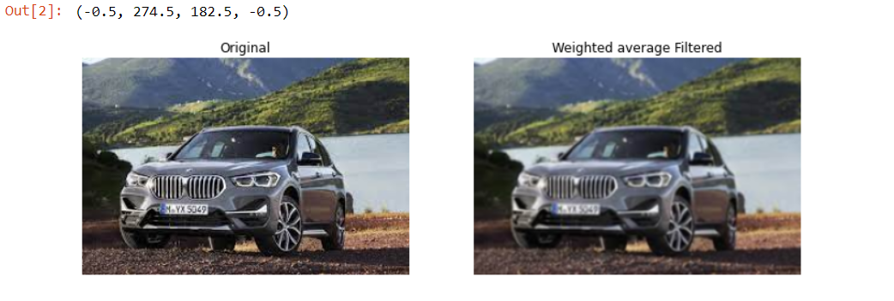

# Implementation-of-Filters
## Aim:
To implement filters for smoothing and sharpening the images in the spatial domain.

## Software Required:
Anaconda - Python 3.7

## Algorithm:
### Step 1:
</br>
Import necessary packages numpy,cv2 and matplotlib and save the image which you would like to perform Image filtering.

</br> 

### Step 2:
</br>
Use the syntax cv2.filter2D() to perform filtering.

</br> 

### Step 3:
</br>
For average filter use the syntax = kernel=np.ones((9,9),np.float32)/81 .

</br> 

### Step 4:
</br>
For the weighted average filter use the syntax = kernel=np.array([[1,2,1],[2,4,2],[1,2,1]])/16 .
</br> 


### Step 5:

</br>
For the gaussian filter use the syntax = gaussian_blur=cv2.GaussianBlur(src=image2,ksize=(11,11),sigmaX=0,sigmaY=0).


</br> 

### step 6:
</br>
For the Median filter use the syntax = median=cv2.medianBlur(src=image2,ksize=11).

</br>

### step 7:
</br>
For the Laplacian kernel filter use the syntax = kernel=np.array([[0,1,0],[1,-4,1],[0,1,0]]).

</br>

### step 8:
</br>
For the Laplacian operator use the syntax = lap_operator=cv2.Laplacian(image2,cv2.CV_64F).

</br>


### step 9:

</br>
Run the programs and execute the output.

</br>

## Program:
### Developed By   : SOUVIK KUNDU
### Register Number: 212221230105
</br>

### 1. Smoothing Filter:

i) Using Averaging Filter
```

import cv2
import numpy as np
import matplotlib.pyplot as plt
image1=cv2.imread("BMW.jpg")
image2=cv2.cvtColor(image1,cv2.COLOR_BGR2RGB)
# Averaging filter
kernel=np.ones((9,9),np.float32)/81
image3=cv2.filter2D(image2,-1,kernel)

plt.figure(figsize = (12,12))
plt.subplot(1,2,1)
plt.imshow(image2)
plt.title('Original')
plt.axis('off')


plt.subplot(1,2,2)
plt.imshow(image3)
plt.title('Average Filtered')
plt.axis('off')


```
ii) Using Weighted Averaging Filter

```
import cv2
import numpy as np
import matplotlib.pyplot as plt
image1=cv2.imread("BMW.jpg")
image2=cv2.cvtColor(image1,cv2.COLOR_BGR2RGB)
# Weighted averaging filter
kernel=np.array([[1,2,1],[2,4,2],[1,2,1]])/16
image3=cv2.filter2D(image2,-1,kernel)

plt.figure(figsize = (12,12))
plt.subplot(1,2,1)
plt.imshow(image2)
plt.title('Original')
plt.axis('off')


plt.subplot(1,2,2)
plt.imshow(image3)
plt.title('Weighted average Filtered')
plt.axis('off')


```
iii) Using Gaussian Filter

```
import cv2
import numpy as np
import matplotlib.pyplot as plt
image1=cv2.imread('BMW.jpg')
image2=cv2.cvtColor(image1,cv2.COLOR_BGR2RGB)
# Gaussian filter
gaussian_blur=cv2.GaussianBlur(src=image2,ksize=(11,11),sigmaX=0,sigmaY=0)
plt.figure(figsize = (12,12))
plt.subplot(1,2,1)
plt.imshow(image2)
plt.title('Original')
plt.axis('off')

plt.subplot(1,2,2)
plt.imshow(gaussian_blur)
plt.title('Gaussian Filtered')
plt.axis('off')

```

iv) Using Median Filter
```
import cv2
import numpy as np
import matplotlib.pyplot as plt
image1=cv2.imread('BMW.jpg')
image2=cv2.cvtColor(image1,cv2.COLOR_BGR2RGB)
# Median Filter
median=cv2.medianBlur(src=image2,ksize=11)
plt.figure(figsize = (12,12))
plt.subplot(1,2,1)
plt.imshow(image2)
plt.title('Original')
plt.axis('off')

plt.subplot(1,2,2)
plt.imshow(median)
plt.title('Median Filtered')
plt.axis('off')

```

### 2. Sharpening Filters
i) Using Laplacian Kernal
```
import cv2
import numpy as np
import matplotlib.pyplot as plt
image1=cv2.imread("BMW.jpg")
image2=cv2.cvtColor(image1,cv2.COLOR_BGR2RGB)
# Laplacian Kernel
kernel=np.array([[0,1,0],[1,-4,1],[0,1,0]])
image3=cv2.filter2D(image2,-1,kernel)

plt.figure(figsize = (12,12))
plt.subplot(1,2,1)
plt.imshow(image2)
plt.title('Original')
plt.axis('off')


plt.subplot(1,2,2)
plt.imshow(image3)
plt.title('Laplacian kernel Filtered')
plt.axis('off')

```
ii) Using Laplacian Operator
```
import cv2
import numpy as np
import matplotlib.pyplot as plt
image1=cv2.imread('BMW.jpg')
image2=cv2.cvtColor(image1,cv2.COLOR_BGR2RGB)
# Laplacian operator
lap_operator=cv2.Laplacian(image2,cv2.CV_64F)
plt.figure(figsize = (12,12))
plt.subplot(1,2,1)
plt.imshow(image2)
plt.title('Original')
plt.axis('off')

plt.subplot(1,2,2)
plt.imshow(lap_operator)
plt.title('Laplacian operator Filtered')
plt.axis('off')

```

## OUTPUT:
### 1. Smoothing Filters
</br>

i) Using Averaging Filter


ii) Using Weighted Averaging Filter


iii) Using Gaussian Filter


iv) Using Median Filter


### 2. Sharpening Filters
</br>

i) Using Laplacian Kernal


ii) Using Laplacian Operator
 

## Result:
Thus the filters are designed for smoothing and sharpening the images in the spatial domain.
